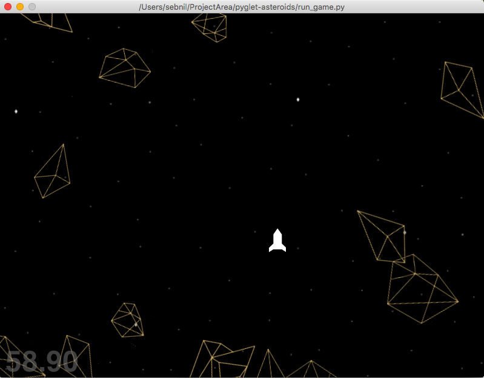

# pyglet-asteroids
I wanted to learn some basic game development in OpenGL and Python. Pyglet is very good for this kind of thing. Unfortunately it seems to have a less active community compared to Pygame (but in my opinion Pyglet seems much more Pythonic in its design). My game will not win any awards since it is a Asteroids clone. But it has some other features like:

Bullets have recoil and will slightly accelerate the ship rearwards when shooting.
Game graphics from a professional artist. (nalishac.com)
When I started this list I thought there would be more features but I think this is it.

Using a lot of code and inspiration from:
  - http://steveasleep.com/pyglettutorial.html
  
Code structure and inspiration from:
  - http://tartley.com/?p=250
